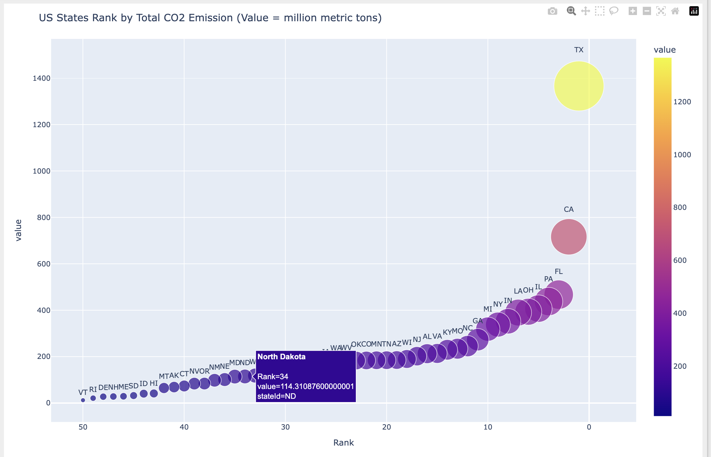
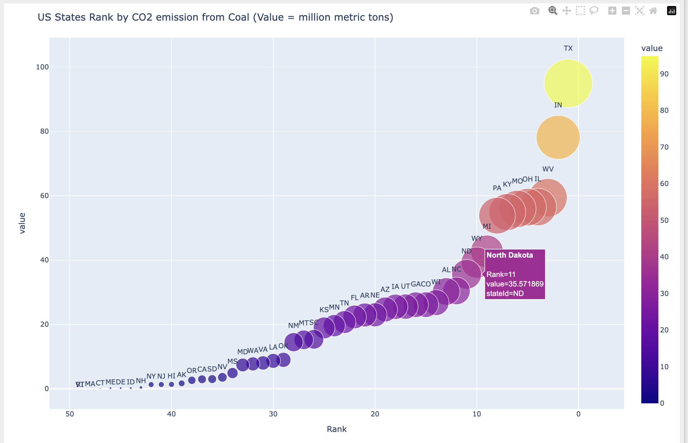

# Data Ingestion from various Sources

This project showcases workflows for data ingestion from various sources including REST API, KCL - Kaggle Clinet lIBRARY, SQL Databases, NoSQL Database - MongoDB, ObjectStorage (S3), etc.

Important step: `ignore all config files` in gitignore to hide access codes from the public.

1. **Ingestion from REST API and sving to Blob container**:

- Ingestion of CO₂ and coal emissions data in the US from EIA using REST API.

Steps:

    a). create api key at EIA & store the file in `config file`.

    b). create sas key for blob storage and save it as `config file`.

    c). explore api page to get specific data that you want and get ednpoint

    d). ingest

2. **World Population (Kaggle)**: Examines global population trends using datasets ingested with the Kaggle Client Library (KCL).

   ```

   from kaggle.api.kaggle_api_extended import KaggleApi

   # Instantiate the Kaggle API
   api = KaggleApi()

   # Authentication defaults to use the config file in the predefined location.
   api.authenticate()

   # Example: List datasets
   datasets = api.dataset_list()
   for dataset in datasets:
       print(dataset)


   ```

3. **SQL Database Source - PostgreSQL**: [TBD]

4. **NoSQL Database Source - MongoDB**: [TBD]

5. **Object storage Source - AWS S3**: [TBD]

6. **File System Source - AWS EFS**: [TBD]

## Sources

- **REST API Source**: energy & emissions data programmatically from EIA API.
- **KCL - Kaggle Source**: Using KCL (Kaggle Clinet Library) for ingesting data, `global population` dataset.

### Data Analysis

- **Energy Emissions**:

  - Identifies historical trends in U.S. CO₂ and coal emissions.
  - Highlights emission-heavy sectors and their contributions.

- **World Population**:
  - Explores global population distribution and growth.
  - Visualizes regional trends and urbanization patterns.

---

## Technologies Used

- **APIs**: EIA REST API, Kaggle Client Library (KCL).
- **Data Processing**: Python (`pandas`, `numpy`).
- **Visualization**: `matplotlib`, `seaborn`.
- **Tool**: `JupyterNotebook`

---

## Insights US Co2 emissions:




